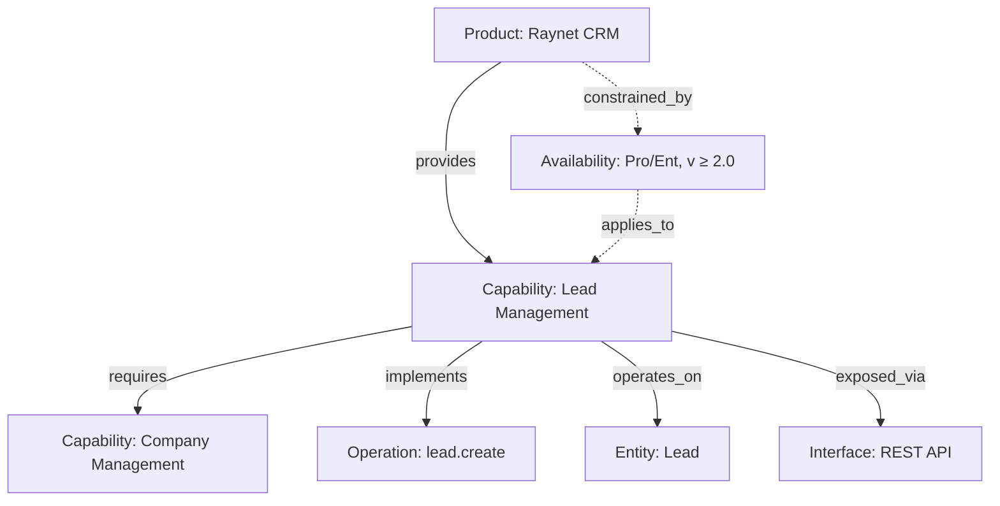

# Capability Registry — Metodika

> **Překladová poznámka:**
>
> Tento soubor je **český překlad** dokumentu [`CAPABILITY-REGISTRY-METHODOLOGY.md`](CAPABILITY-REGISTRY-METHODOLOGY.md)
> (anglický originál — zdroj pravdy). Při jakékoli úpravě obsahu je nutné synchronizovat obě verze; pokud se rozcházejí, 
> **autoritativní je anglická verze**. Při překladu drž 1:1 strukturu sekcí a odkazů.

> **AI asistenti — kdy načítat tento soubor (Claude Code, Gemini):**
>
> **Načti plně, když:**
>
> - Provádíš onboarding na Capability Registry, nebo měníš konvence / ID gramatiku / typy uzlů a vztahů
> - Validuješ celkový design registru (cross-vendor mapování, availability model, governance)
> - Píšeš novou sekci metodiky nebo její překlad
>
> **NENAČÍTEJ pro:**
>
> - Tvorbu konkrétního souboru registru (YAML uzel, relations file) — použij machine-readable router
>   [`capability-registry/INDEX.md`](capability-registry/INDEX.md), který obsahuje per-typ template,
>   JSON schema, ID gramatiku a rozhodovací pravidla
> - BPMN modelování — viz [`BPMN-METHODOLOGY.md`](BPMN-METHODOLOGY.md)
> - Procesní analýzu — viz [`PROCESS-ANALYSIS-METHODOLOGY-ICT.cs.md`](PROCESS-ANALYSIS-METHODOLOGY-ICT.cs.md)
> - Brainstorming session — viz [`BRAINSTORMING.md`](BRAINSTORMING.md)
> - Single-question Q&A nebo debug konverzace
>
> **Autoritativní rozsah:** principy a struktura Capability Registry,ID gramatika, typy uzlů a vztahů, availability model, governance.
> Operativní detaily (konkrétní YAML, schema validace) řeší [`capability-registry/INDEX.md`](capability-registry/INDEX.md).

## Klíčové principy

1. **Capability ≠ API** — schopnost není endpoint, je to věcná funkce systému.
2. **Vendor-neutral** — capability pojmenovávej podle významu, ne podle produktu.
3. **Vztahy = data** — graf hran je stejně důležitý jako sada uzlů.
4. **Availability je first-class** — capability není boolean, je dostupná za podmínek.
5. **AI-ready** — registry musí být strojově čitelný a použitelný pro agenty.

## 1. Účel

Capability Registry popisuje, **co** softwarové produkty umí, **za jakých podmínek**, **přes jaká rozhraní**,
**nad jakými entitami** a **jak jsou závislé** mezi sebou. Slouží pro:

- výběr a porovnání systémů,
- analýzu integračních možností,
- dopadovou analýzu změn,
- jako znalostní bázi pro AI agenty.

Není to standard ani produkt, je to **architektonický přístup** kombinující prvky TOGAF/ArchiMate, OpenAPI, RDF a TM Forum ODA.

## 2. Základní princip — graf znalostí

Registry je graf. Pět uzlů, šest základních hran:

```text
[Product] ──provides────────> [Capability]
[Capability] ──requires─────> [Capability]
[Capability] ──implements───> [Operation]
[Capability] ──operates_on──> [Entity]
[Capability] ──exposed_via──> [Interface]
[Product] ──constrained_by──> [Availability]   (volitelné, viz §5)
```



## 3. Typy uzlů

| Typ | Význam | ID příklad | Šablona |
| ---------- | ------ | ---------- | ------- |
| Product | Konkrétní software/SaaS | `product:raynet-crm` | [product.template.yaml](capability-registry/templates/product.template.yaml) |
| Module | Komponenta modulárního produktu (viz §3a) | `module:odoo.crm` | [module.template.yaml](capability-registry/templates/module.template.yaml) |
| Capability | Vendor-neutrální schopnost | `capability:crm.lead-management` | [capability.template.yaml](capability-registry/templates/capability.template.yaml) |
| Operation | Konkrétní implementace v produktu | `operation:raynet.lead.create` | [operation.template.yaml](capability-registry/templates/operation.template.yaml) |
| Entity | Datový objekt, nad kterým capability pracuje | `entity:crm.lead` | [entity.template.yaml](capability-registry/templates/entity.template.yaml) |
| Interface | Způsob přístupu (REST/gRPC/CLI/...) | `interface:raynet.rest-api` | [interface.template.yaml](capability-registry/templates/interface.template.yaml) |
| Availability | Podmínky dostupnosti capability v produktu | `availability:raynet-crm.crm.lead-management` | [availability.template.yaml](capability-registry/templates/availability.template.yaml) |

Capability je vždy abstraktní (`Lead Management`), Operation je vždy produktově specifická (`raynet.lead.create`, `odoo.lead.create`).

Kategorie capability: `business`, `domain`, `functional`, `technical`, `ai`.

## 3a. Kdy zavést modul

Uzel `module` se zavádí, když je produkt **modulární** — tj. jeho capabilities, licence, závislosti nebo verze žijí na úrovni modulu, ne
produktu. Příklady: Odoo (CRM / Sales / Helpdesk / Accounting), Salesforce (Sales Cloud / Service Cloud / Marketing Cloud), ETIS (moduly CRM / HR / Helpdesk).

Rozhodnutí se zakóduje do **`product.composition`**. Toto pole je **povinné na každém produktovém uzlu**. Nabývá právě jedné ze dvou vzájemně se vylučujících hodnot: `monolith`, nebo `modular`. Vyber jednu podle pravidel níže:

- `composition: monolith` — capabilities, licence a tarify se vztahují na produkt jako celek. **Moduly se nezakládají**. `provides` visí na produktu.
  Příklady: Microsoft Planner, Zammad.
- `composition: modular` — alespoň některé capabilities, licence nebo závislosti jsou modulové. **Jeden modul na logicky oddělitelnou komponentu**.
  `provides` visí na modulu, ne na produktu. Příklady: Odoo, ETIS, InfiniteCare.

`composition` je ortogonální k poli `type` (`software | service | platform`), které popisuje *co* produkt je, nikoli *jak* je složený. Salesforce je
`service` + `modular`; Zammad je `software` + `monolith`.

Modul vždy patří právě jednomu produktu přes povinné pole `product:`
(žádná samostatná relace `composed_of`; vztah modul → produkt je pole
v YAML uzlu). Hybrid placement pravidlo platí pro všechny relace
(`provides`, `requires`, `operates_on`, `implements`, `exposed_via`,
`maps_to`) — hrana visí na úrovni, na které dává smysl uvažovat o
licenci / verzi / dostupnosti.

Plné zdůvodnění, detaily schématu a pravidlo cross-type validátoru jsou
v [ADR-002](../adr/ADR-002-capability-registry-module-layer.md).

## 4. Typy vztahů

| Vztah | Význam |
| ----- | ------ |
| `provides` | Product poskytuje Capability (volitelně s availability) |
| `requires` | Capability potřebuje jinou Capability k fungování |
| `implements` | Capability je realizována konkrétní Operation |
| `operates_on` | Capability pracuje s Entity |
| `exposed_via` | Capability je dostupná přes Interface |
| `maps_to` | Mapování mezi capabilities různých produktů (cross-vendor) |
| `constrained_by` | Product/Capability má samostatný Availability uzel |

Všechny vztahy se ukládají do `relations/<type>.yaml` jako pole — viz
[relation.template.yaml](capability-registry/templates/relation.template.yaml).

## 5. Availability — capability není boolean

Stejná capability může být v jednom plánu, jedné verzi, jedné edici, regionu nebo pro určité role.
Vztah `provides` proto nese **availability blok**:

```yaml
- from: product:raynet-crm
  type: provides
  to: capability:crm.lead-management
  availability:
    status: active
    license:
      required: true
      plans: [Professional, Enterprise]
    version: { min: "2.0", max: null }
    permissions:
      roles: [admin, sales-manager]
```

Plný seznam dimenzí (license, version, edition, modules, featureFlags, permissions, region, deployment, limits)
a JSON schema je v [availability.template.yaml](capability-registry/templates/availability.template.yaml) +
[availability.schema.json](capability-registry/schemas/availability.schema.json).

**Inline blok vs. samostatný uzel** — kritéria a migrace jsou v
[decision-availability.md](capability-registry/decision-availability.md).

Stavy: `active`, `preview`, `beta`, `deprecated`, `disabled`, `removed`, `unknown`.

## 6. Struktura registru

```text
capability-registry/
├── nodes/
│   ├── products/        product:*  YAML uzly
│   ├── modules/         module:*   (jen pokud parent product.composition=modular)
│   ├── capabilities/    capability:*
│   ├── operations/      operation:*
│   ├── entities/        entity:*
│   ├── interfaces/      interface:*
│   └── availability/    availability:*  (jen pokud je samostatný uzel)
├── relations/
│   ├── provides.yaml
│   ├── requires.yaml
│   ├── implements.yaml
│   ├── operates-on.yaml
│   ├── exposed-via.yaml
│   └── maps-to.yaml
├── mappings/            cross-product mapování (Raynet ↔ Odoo apod.)
├── diagrams/            Mermaid přehledy
└── ai/                  AI skills, policies, prompts
```

**Source of truth pravidlo**: `nodes/` + `relations/` jsou primární. Vše ostatní (lidsky čitelné průřezy,
diagramy) je odvoditelné nebo generované.

## 7. Evidence a ověření

Každý uzel a každý vztah nese povinný `verification` blok. Stavy:

| Stav | Význam |
| ----------- | ------ |
| `declared` | tvrdí vendor / obchod |
| `documented` | je v oficiální dokumentaci |
| `tested` | bylo otestováno |
| `production` | běží v produkci |
| `deprecated` | zastaralé |
| `unknown` | neověřeno |

Schema: [verification.schema.json](capability-registry/schemas/verification.schema.json).

```yaml
verification:
  status: tested
  source: internal-test
  lastChecked: "2026-05-05"
  evidence:
    - products/raynet-crm/evidence/create-lead-test.md
```

Neověřené informace označuj `unknown`, ne falešně `documented`.

## 8. Konvence pojmenování

```text
product:<slug>
capability:<domain>.<name>             # max 4 úrovně
operation:<product>.<entity>.<action>
entity:<domain>.<name>
interface:<product>.<name>
availability:<product>.<capability-ns>
```

Slug: `[a-z][a-z0-9-]*`. Tečka odděluje hierarchické úrovně, pomlčka slova v rámci úrovně.
Plná gramatika včetně regexů je v [id-grammar.md](capability-registry/id-grammar.md).

## 9. Workflow tvorby záznamu

1. Založ `Product` uzel (`nodes/products/<slug>.yaml`).
2. Založ vendor-neutrální `Capability` uzly, na které se chceš odkazovat.
3. Založ `Entity`, `Interface` a `Operation` uzly podle potřeby.
4. Zapiš vztahy do `relations/*.yaml` (`provides`, `implements`, `operates-on`, `exposed-via`).
5. Do vztahu `provides` doplň `availability` blok.
6. Doplň `verification` (kde, kdy, kým ověřeno) ke všem důležitým záznamům.
7. Validuj: schema validace + kontrola ID gramatiky.

Detailní šablony pro každý krok jsou v [capability-registry/templates/](capability-registry/templates/).

## 10. AI-ready rozšíření

Volitelné `ai:` pole umožňuje agentům rozhodovat o automatizaci capability:

```yaml
ai:
  canBeAutomated: true
  riskLevel: medium          # low | medium | high | critical
  humanApprovalRequired: true
  typicalTasks:
    - createLeadFromEmail
    - summarizeLeadHistory
```

Úrovně rizika: `low` (jen čtení), `medium` (zápis nízkého dopadu), `high` (změna obchodních dat),
`critical` (právní/finanční/bezpečnostní dopad).

## 11. Typické dotazy nad registrem

Registry by mělo umět odpovědět na otázky typu:

- Které produkty podporují *Lead Management*?
- Od jaké verze je capability dostupná v Enterprise edici?
- Přes jaká API je capability dostupná?
- Které capabilities jsou vhodné pro AI automatizaci a které vyžadují schválení?
- Pokud zruším produkt X, které integrace tím rozbiju? (`provides`/`requires` traverzál)

## 12. Best Practice Stack

Capability Registry navazuje na zavedené přístupy v jednotlivých vrstvách:

| Vrstva | Standardy |
| ------ | --------- |
| Business architecture | TOGAF, ArchiMate |
| Capability modeling | vlastní registry (L1–L4) |
| Technical interface | OpenAPI, AsyncAPI, gRPC |
| Knowledge graph | RDF / OWL |
| Industry models | TM Forum ODA, IT4IT |
| AI layer | tool catalog, agent skill registry |

Tok znalostí: **TOGAF/ArchiMate → Capability Registry → OpenAPI → Graph → AI agent.**

## 13. Pravidla, která se snadno poruší

1. Capability pojmenovávej podle významu, ne podle produktu (`crm.lead-management`, ne `raynet.lead`).
2. Operation je vždy produktově specifická (`operation:raynet.lead.create`).
3. Product nikdy nespojuj přímo s Operation — vždy přes Capability.
4. Availability ukládej primárně na vztah `provides`. Samostatný uzel až podle
   [decision-availability.md](capability-registry/decision-availability.md).
5. Každá důležitá informace má `verification` se stavem a `lastChecked`.
6. Mermaid diagramy jsou pro vysvětlení, ne pro source of truth — ten je v YAML uzlech a vztazích.
7. Neověřené informace = `unknown`. Nikdy ne falešně `documented`.

## 14. Shrnutí

Capability Registry kombinuje katalog schopností, graf vztahů, technickou dokumentaci, evidenci podmínek
dostupnosti a stav ověření do jednoho strojově čitelného modelu.

Nejdůležitější princip:

> **Capability není boolean. Capability je schopnost dostupná za konkrétních podmínek.**

---

**Created**: 2026-05-05
**Last Updated**: 2026-05-05
