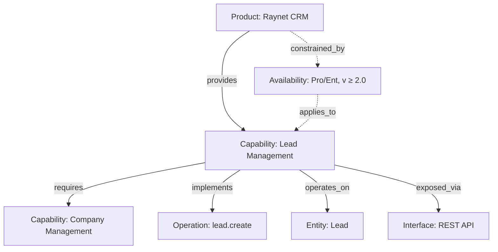

# Capability Registry Methodology

> **AI assistant load scope (Claude Code, Gemini):**
>
> **Load fully when:**
>
> - Onboarding to the Capability Registry, or changing the conventions / ID grammar / node and relation types
> - Validating overall registry design (cross-vendor mapping, availability model, governance)
> - Writing a new section of the methodology or its translation
>
> **Do NOT load for:**
>
> - Authoring an individual registry file (YAML node, relations file) — use the machine-readable router
>   [`capability-registry/INDEX.md`](capability-registry/INDEX.md), which carries per-type templates, 
>   JSON schemas, ID grammar, and decision rules
> - BPMN modeling — see [`BPMN-METHODOLOGY.md`](BPMN-METHODOLOGY.md)
> - Process analysis — see [`PROCESS-ANALYSIS-METHODOLOGY-ICT.cs.md`](PROCESS-ANALYSIS-METHODOLOGY-ICT.cs.md)
> - Brainstorming sessions — see [`BRAINSTORMING.md`](BRAINSTORMING.md)
> - Single-question Q&A or debugging conversations
>
> **Authoritative scope:** the principles and structure of the Capability Registry, ID grammar, node and relation types, availability model,
> governance. Operational details (concrete YAML, schema validation) are handled by [`capability-registry/INDEX.md`](capability-registry/INDEX.md).

## Key principles

1. **Capability ≠ API** — a capability is not an endpoint; it is a domain function of the system.
2. **Vendor-neutral** — name capabilities by meaning, not by product.
3. **Relations = data** — the edge graph is as important as the node set.
4. **Availability is first-class** — a capability is not a boolean; it is available under conditions.
5. **AI-ready** — the registry must be machine-readable and usable by agents.

## 1. Purpose

The Capability Registry describes **what** software products can do, **under what conditions**, **through which interfaces**, **over which entities**,
and **how they depend on each other**. It serves for:

- selecting and comparing systems,
- analyzing integration possibilities,
- impact analysis of changes,
- as a knowledge base for AI agents.

It is neither a standard nor a product; it is an **architectural approach** combining elements of TOGAF/ArchiMate, OpenAPI, RDF, and TM Forum ODA.

## 2. Core principle — knowledge graph

The registry is a graph. Five node types, six basic edges:

```text
[Product] ──provides────────> [Capability]
[Capability] ──requires─────> [Capability]
[Capability] ──implements───> [Operation]
[Capability] ──operates_on──> [Entity]
[Capability] ──exposed_via──> [Interface]
[Product] ──constrained_by──> [Availability]   (optional, see §5)
```



## 3. Node types

| Type | Meaning | ID example | Template |
| ---------- | ------- | ---------- | -------- |
| Product | Concrete software / SaaS | `product:raynet-crm` | [product.template.yaml](capability-registry/templates/product.template.yaml) |
| Module | Component of a modular product (see §3a) | `module:odoo.crm` | [module.template.yaml](capability-registry/templates/module.template.yaml) |
| Capability | Vendor-neutral capability | `capability:crm.lead-management` | [capability.template.yaml](capability-registry/templates/capability.template.yaml) |
| Operation | Concrete implementation in a product | `operation:raynet.lead.create` | [operation.template.yaml](capability-registry/templates/operation.template.yaml) |
| Entity | Data object the capability operates on | `entity:crm.lead` | [entity.template.yaml](capability-registry/templates/entity.template.yaml) |
| Interface | Access mechanism (REST/gRPC/CLI/...) | `interface:raynet.rest-api` | [interface.template.yaml](capability-registry/templates/interface.template.yaml) |
| Availability | Conditions under which a capability is available in a product | `availability:raynet-crm.crm.lead-management` | [availability.template.yaml](capability-registry/templates/availability.template.yaml) |

A Capability is always abstract (`Lead Management`); an Operation is always product-specific (`raynet.lead.create`, `odoo.lead.create`).

Capability categories: `business`, `domain`, `functional`, `technical`, `ai`.

## 3a. When to introduce a module

A `module` node is introduced when a product is **modular** — i.e. when its capabilities, licenses, dependencies or versions live at the module level,
not at the product level. Examples: Odoo (CRM / Sales / Helpdesk / Accounting), Salesforce (Sales Cloud / Service Cloud / Marketing Cloud), ETIS (CRM / HR / Helpdesk modules).

The decision is encoded in **`product.composition`**. This field is **required on every product node**. It accepts exactly one of two mutually exclusive values: `monolith` or `modular`. Pick one according to the rules below:

- `composition: monolith` — capabilities, licenses and tiers apply to the product as a whole. **Do not create modules**. `provides` hangs on the product. 
  Examples: Microsoft Planner, Zammad.
- `composition: modular` — at least some capabilities, licenses or dependencies are module-scoped. **Create one module per logically separable component**. `provides` hangs on the module, not the product.
  Examples: Odoo, ETIS, InfiniteCare.

`composition` is orthogonal to `type` (`software | service | platform`), which describes *what the product is* rather than *how it is composed*.
Salesforce is `service` + `modular`; Zammad is `software` + `monolith`.

A module always belongs to exactly one product via the required `product:` field (no separate `composed_of` relation; module → product is a YAML field).
The hybrid placement rule applies to all relations (`provides`, `requires`, `operates_on`, `implements`, `exposed_via`, `maps_to`) — the edge hangs at
the level where it makes sense to talk about license / version / availability.

Full rationale, schema details, and the cross-type validator rule live in
[ADR-002](../adr/ADR-002-capability-registry-module-layer.md).

## 4. Relation types

| Relation | Meaning |
| -------- | ------- |
| `provides` | Product provides a Capability (optionally with availability) |
| `requires` | A Capability needs another Capability to function |
| `implements` | A Capability is realized by a concrete Operation |
| `operates_on` | A Capability works with an Entity |
| `exposed_via` | A Capability is reachable through an Interface |
| `maps_to` | Mapping between capabilities of different products (cross-vendor) |
| `constrained_by` | Product / Capability has a separate Availability node |

All relations are stored in `relations/<type>.yaml` as arrays — see [relation.template.yaml](capability-registry/templates/relation.template.yaml).

## 5. Availability — a capability is not a boolean

The same capability may be in one plan, one version, one edition, region, or only for certain roles. The `provides` relation therefore carries an **availability block**:

```yaml
- from: product:raynet-crm
  type: provides
  to: capability:crm.lead-management
  availability:
    status: active
    license:
      required: true
      plans: [Professional, Enterprise]
    version: { min: "2.0", max: null }
    permissions:
      roles: [admin, sales-manager]
```

The full list of dimensions (license, version, edition, modules, featureFlags, permissions, region, deployment, limits) and the JSON schema live in
[availability.template.yaml](capability-registry/templates/availability.template.yaml) + [availability.schema.json](capability-registry/schemas/availability.schema.json).

**Inline block vs. separate node** — criteria and migration are in [decision-availability.md](capability-registry/decision-availability.md).

States: `active`, `preview`, `beta`, `deprecated`, `disabled`, `removed`, `unknown`.

## 6. Registry structure

```text
capability-registry/
├── nodes/
│   ├── products/        product:*  YAML nodes
│   ├── modules/         module:*   (only when parent product.composition=modular)
│   ├── capabilities/    capability:*
│   ├── operations/      operation:*
│   ├── entities/        entity:*
│   ├── interfaces/      interface:*
│   └── availability/    availability:*  (only when modeled as a separate node)
├── relations/
│   ├── provides.yaml
│   ├── requires.yaml
│   ├── implements.yaml
│   ├── operates-on.yaml
│   ├── exposed-via.yaml
│   └── maps-to.yaml
├── mappings/            cross-product mappings (Raynet ↔ Odoo, etc.)
├── diagrams/            Mermaid overviews
└── ai/                  AI skills, policies, prompts
```

**Source of truth rule**: `nodes/` + `relations/` are primary. Everything else (human-readable cross-sections, diagrams) is derivable or generated.

## 7. Evidence and verification

Every node and every relation carries a mandatory `verification` block. States:

| State | Meaning |
| ----- | ------- |
| `declared` | claimed by the vendor / sales |
| `documented` | present in official documentation |
| `tested` | has been tested |
| `production` | running in production |
| `deprecated` | obsolete |
| `unknown` | not verified |

Schema: [verification.schema.json](capability-registry/schemas/verification.schema.json).

```yaml
verification:
  status: tested
  source: internal-test
  lastChecked: "2026-05-05"
  evidence:
    - products/raynet-crm/evidence/create-lead-test.md
```

Mark unverified information as `unknown`, never falsely as `documented`.

## 8. Naming conventions

```text
product:<slug>
capability:<domain>.<name>             # max 4 levels
operation:<product>.<entity>.<action>
entity:<domain>.<name>
interface:<product>.<name>
availability:<product>.<capability-ns>
```

Slug: `[a-z][a-z0-9-]*`. Dot separates hierarchical levels; hyphen separates words within a level. The full grammar including regexes is in
[id-grammar.md](capability-registry/id-grammar.md).

## 9. Record-creation workflow

1. Create the `Product` node (`nodes/products/<slug>.yaml`).
2. Create vendor-neutral `Capability` nodes you intend to reference.
3. Create `Entity`, `Interface`, and `Operation` nodes as needed.
4. Write relations into `relations/*.yaml` (`provides`, `implements`, `operates-on`, `exposed-via`).
5. Add an `availability` block to the `provides` relation.
6. Add `verification` (where, when, by whom verified) to every important record.
7. Validate: schema validation + ID grammar check.

Detailed templates for each step live in [capability-registry/templates/](capability-registry/templates/).

## 10. AI-ready extension

The optional `ai:` field lets agents decide about automating a capability:

```yaml
ai:
  canBeAutomated: true
  riskLevel: medium          # low | medium | high | critical
  humanApprovalRequired: true
  typicalTasks:
    - createLeadFromEmail
    - summarizeLeadHistory
```

Risk levels: `low` (read-only), `medium` (low-impact write), `high` (changes business data), `critical` (legal / financial / security impact).

## 11. Typical queries over the registry

The registry should be able to answer questions such as:

- Which products support *Lead Management*?
- From which version is the capability available in the Enterprise edition?
- Through which APIs is the capability reachable?
- Which capabilities are suitable for AI automation, and which require approval?
- If I retire product X, which integrations will break? (`provides`/`requires` traversal)

## 12. Best Practice Stack

The Capability Registry builds on established approaches at each layer:

| Layer | Standards |
| ----- | --------- |
| Business architecture | TOGAF, ArchiMate |
| Capability modeling | proprietary registry (L1–L4) |
| Technical interface | OpenAPI, AsyncAPI, gRPC |
| Knowledge graph | RDF / OWL |
| Industry models | TM Forum ODA, IT4IT |
| AI layer | tool catalog, agent skill registry |

Knowledge flow: **TOGAF/ArchiMate → Capability Registry → OpenAPI → Graph → AI agent.**

## 13. Rules that are easy to break

1. Name capabilities by meaning, not by product (`crm.lead-management`, not `raynet.lead`).
2. An Operation is always product-specific (`operation:raynet.lead.create`).
3. Never connect a Product directly to an Operation — always go through a Capability.
4. Store availability primarily on the `provides` relation. A separate node only per [decision-availability.md](capability-registry/decision-availability.md).
5. Every important piece of information has `verification` with a state and `lastChecked`.
6. Mermaid diagrams are for explanation, not source of truth — that lives in the YAML nodes and relations.
7. Unverified information = `unknown`. Never falsely `documented`.

## 14. Summary

The Capability Registry combines a capability catalog, a relation graph, technical documentation, evidence of availability conditions, and verification state into a
single machine-readable model.

The most important principle:

> **A capability is not a boolean. A capability is an ability available under specific conditions.**

---

**Created**: 2026-05-07
**Last Updated**: 2026-05-07
